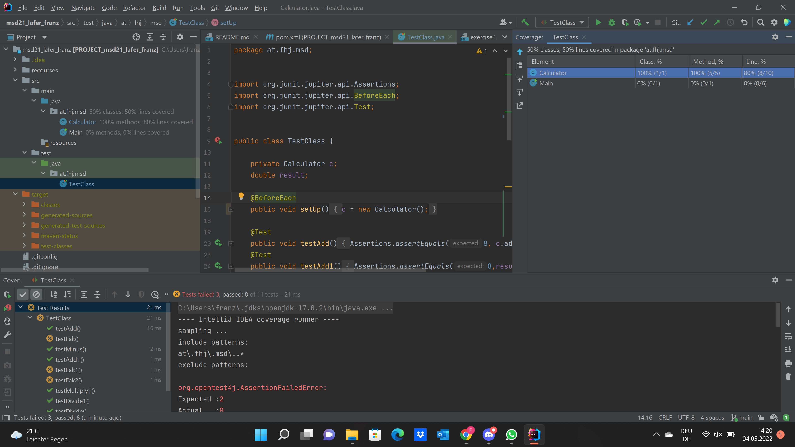

# Exercise 4

## Testing

For my JUnit tests I tested each
method from my "Calculator" class with simple numbers.
To be sure with my calculator I added additional operations with the operators
"+, -, *, /" with the same numbers as in the calculator methods.

After that I added an additional method: the fakulty of a number. I also built
it recursive. In the first step of this method I check if the number I give
the method is bigger than 1. If the number is below 0 the method returns 0.

## Testing screenshots

