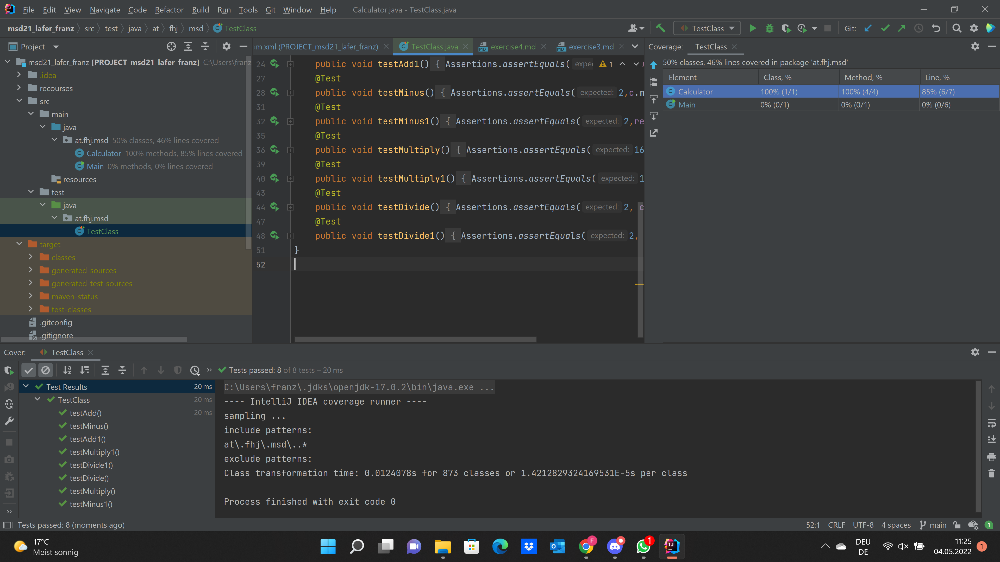

# Exercise 4

## Testing

For my JUnit tests I tested each
method from my "Calculator" class with simple numbers.
To be sure with my calculator I added additional operations with the operators
"+, -, *, /" with the same numbers as in the calculator methods.

## Testing screenshots

